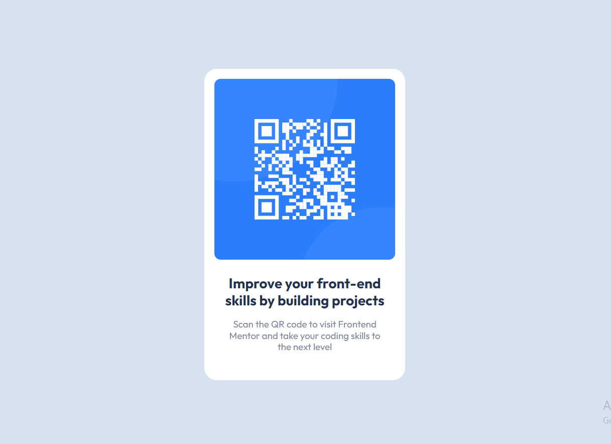

# Frontend Mentor - Qr-code component solution

This is a solution to the [Qr-code component challenge on Frontend Mentor](https://www.frontendmentor.io/challenges/qr-code-component-iux_sIO_H). Frontend Mentor challenges help you improve your coding skills by building realistic projects.

## Table of contents

- [Overview](#overview)
  - [Screenshot](#screenshot)
  - [Links](#links)
- [My process](#my-process)
  - [Built with](#built-with)
- [Author](#author)

## Overview

### Screenshot

### Links

- Solution URL: [https://github.com/vitalii-moroz-ua/qr-code-component](https://github.com/vitalii-moroz-ua/qr-code-component)

## My process

### Built with

- Semantic HTML5 markup
- CSS custom properties
- Flexbox
- Responsive design

## Author

- Frontend Mentor - [@vitalii-moroz-ua](https://www.frontendmentor.io/profile/vitalii-moroz-ua)
